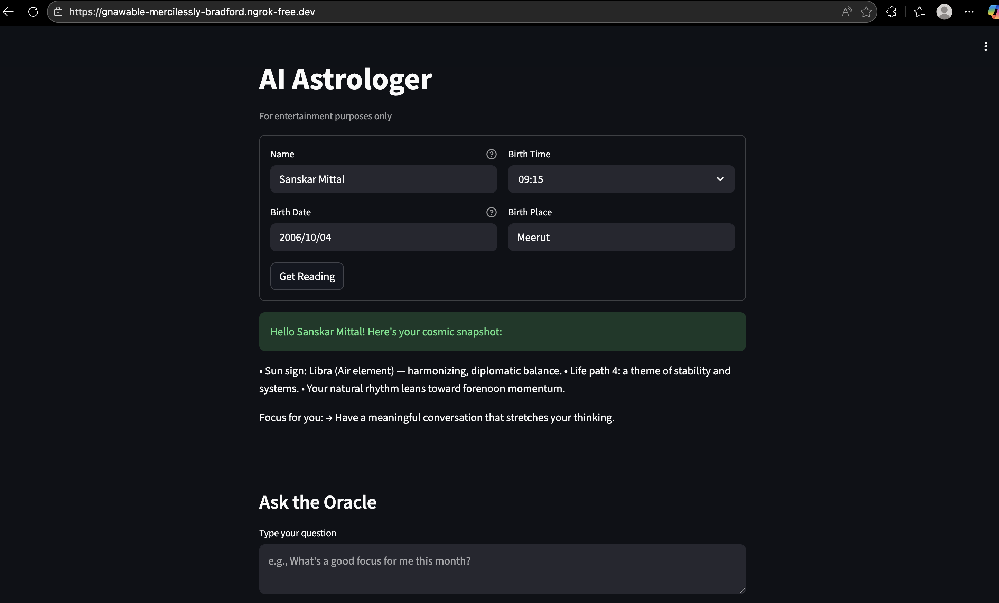

# 🌌 AI Astrologer

A fun and interactive AI-powered astrology app built with Streamlit.

# 🔮 Live Demo

https://gnawable-mercilessly-bradford.ngrok-free.dev/

# ⭐ Overview

AI Astrologer is a Streamlit-based web application that blends traditional astrology inputs with AI-generated insights.
Users can enter their birth details to receive a personalized cosmic profile, and can ask open-ended questions through an interactive “Ask the Oracle” feature powered by Large Language Models.

This project is designed for learning, demos, and entertainment purposes only.

# ✨ Features

🔹 Birth Chart Reader

Enter Name, Birth Date, Birth Time, and Birth Place

Generates a personalized Astrology Reading

Uses a custom profile builder from astrologer.core

🔹 Ask the Oracle

Ask any question (career, love, life, etc.)

Oracle uses your birth profile for tailored responses

Intelligent defaults if birth details are missing

🔹 Clean & Modern UI

Dark theme

Organized layout with Streamlit forms

Loading spinners for immersive experience

# 🧠 How It Works

The app is divided into two main components:

1. app.py

Handles:

UI / Streamlit layout

Form inputs

User session management

Displaying readings and oracle responses

2. astrologer/core.py

Contains:

build_profile()

generate_reading()

answer_question()

InputData dataclass

All AI logic is cleanly separated from UI.

# 🏗️ Tech Stack

Python

Streamlit

Gemini API / LLMs

Ngrok (for public demo)

Custom Prompt Engineering
